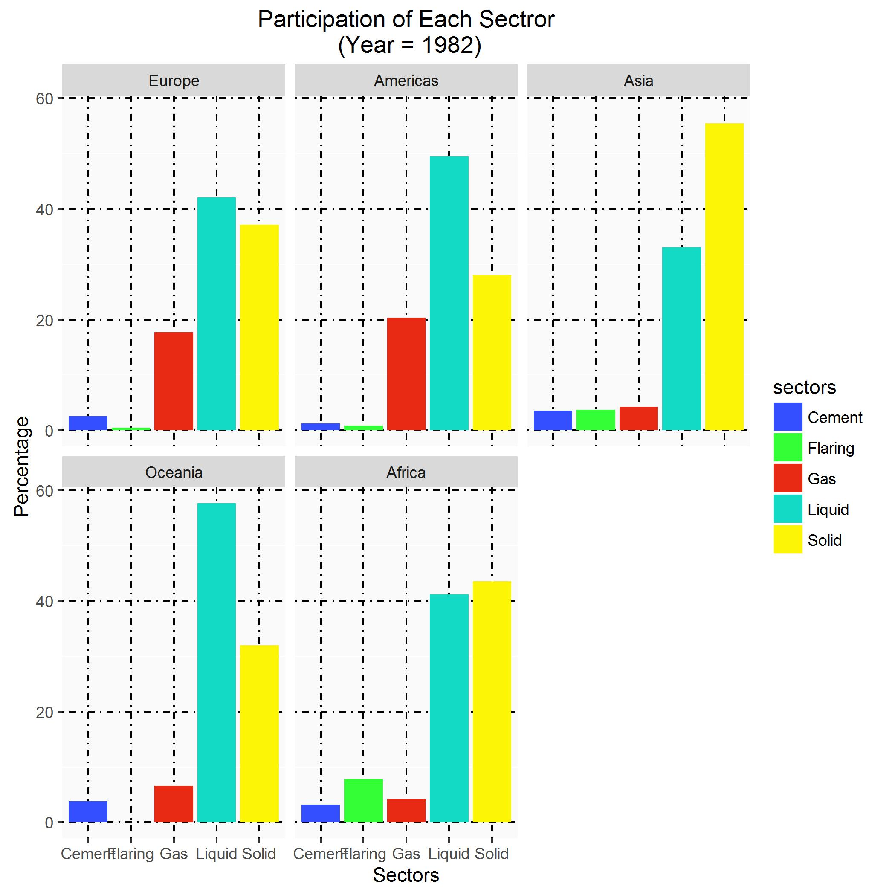
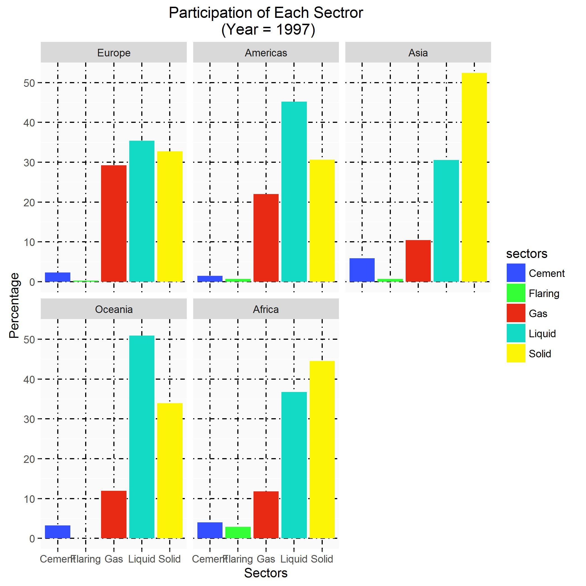
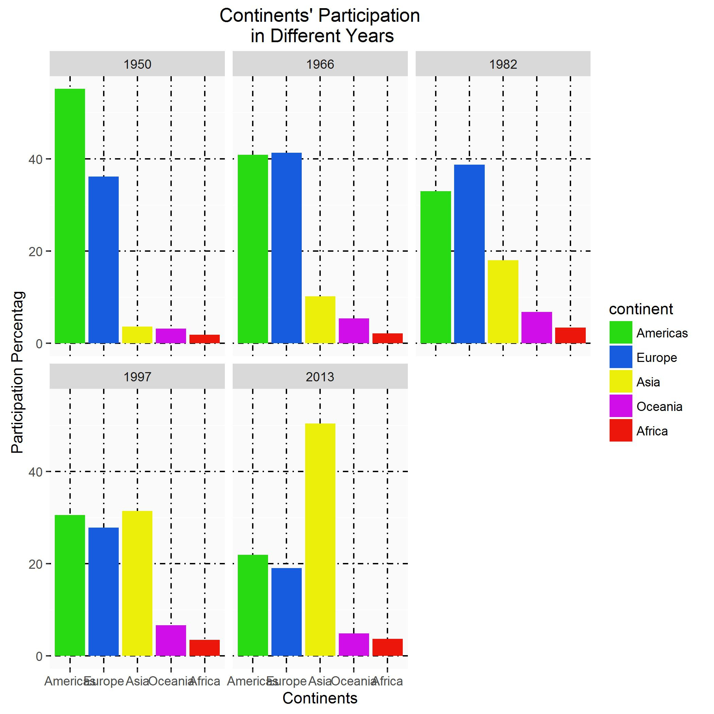
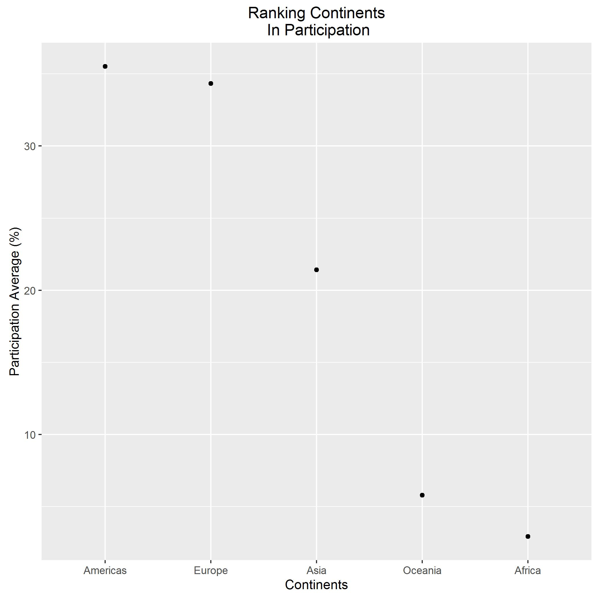

```{r setup, include=FALSE}
knitr::opts_chunk$set(echo = TRUE)
```

## Portion of Each Sector in Carbon Emission
Firstly, portion of participation in each sector is extracted from raw data. Sectors participating in carbon emission are solid fuel, gas fuel, and liquid fuel consumption. Moreover, cement produvtion and gas flaring are included in partipating sectors.

The following tables show percentage of each sector for different continents in different years.

```{r}
library(tidyverse)
library(readr)
Continent_Portions <- dget("Continent_Portions.text") %>% 
  rename(Gas = Gas_Percent,
         Liquid = Liquid_Percent,
         Solid = Solid_Percent,
         Cement = Cement_Percent,
         Flaring = Flaring_Percent)

Continent_Portions %>% 
  filter(year %in% c(1950,1966, 1982, 1997, 2013), 
         continent == "Africa") %>% 
  knitr:: kable()

Continent_Portions %>% 
  filter(year %in% c(1950,1966, 1982, 1997, 2013), 
         continent == "Americas") %>% 
  knitr:: kable()

Continent_Portions %>% 
  filter(year %in% c(1950,1966, 1982, 1997, 2013), 
         continent == "Asia") %>% 
  knitr:: kable()

Continent_Portions %>% 
  filter(year %in% c(1950,1966, 1982, 1997, 2013), 
         continent == "Europe") %>% 
  knitr:: kable()

Continent_Portions %>% 
  filter(year %in% c(1950,1966, 1982, 1997, 2013), 
         continent == "Oceania") %>% 
  knitr:: kable()
```

In the following figures, bar plot related to portion of carbon emission caused by each sector is depicted for each continent. It can be concoluded from the graphs that in the middle parts of previous century, solid fuels were the dominant cause of carbon emission, while gas and liquid fuels were in minority. This habit has been changed and participation percentage of liquid and gas fuels have been increased by time. Moreover, during recent years liquid and gas fuels were dominant reason of carbon emission







After seeing the consiquenses of different sectors in different continents and different years, now we are ready to see the participation percentage of each continent in carbon emission.

The tables below show participation of each continent in 1950, 1966, 1982, 2013. This amount is shown visually in bar charts related to aforementioned years.

```{r}
Continent_Participation <- dget("Continent_Participation.text")

Continent_Participation %>% 
  filter(year %in% c(1950,1966, 1982, 1997, 2013), 
         continent == "Africa") %>% 
  knitr:: kable()

Continent_Participation %>% 
  filter(year %in% c(1950, 1966, 1982, 1997, 2013),
         continent == "Americas") %>% 
  knitr:: kable()

Continent_Participation %>% 
  filter(year %in% c(1950, 1966, 1982, 1997, 2013),
         continent == "Asia") %>% 
  knitr:: kable()

Continent_Participation %>% 
  filter(year %in% c(1950, 1966, 1982, 1997, 2013),
         continent == "Europe") %>% 
  knitr:: kable()

Continent_Participation %>% 
  filter(year %in% c(1950, 1966, 1982, 1997, 2013),
         continent == "Oceania") %>% 
  knitr:: kable()
```



It can be seen that in the middle years of previous century, Americas and Europe were leading continents in carbon emission, but they have given their position to Asia during recent years.

Then, it is useful to rank continents according to their average carbon emission since 1950. The figure below shows this ranking



It is seen that Americas and Europe were leading continents according to their average contribution in carbon emission (35%) followed by Asia (21%). Oceania and Africa were in minority in comparison to their counterparts in thi sense (less than 10%)

