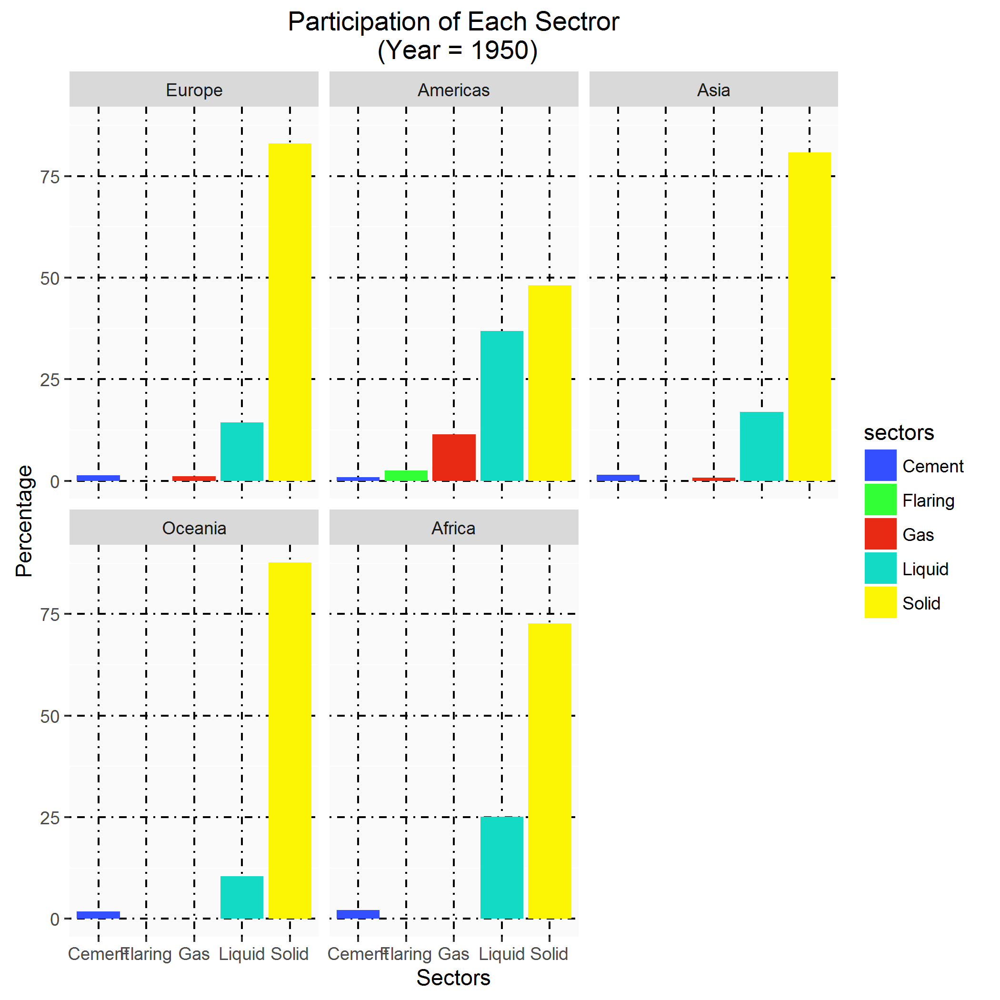
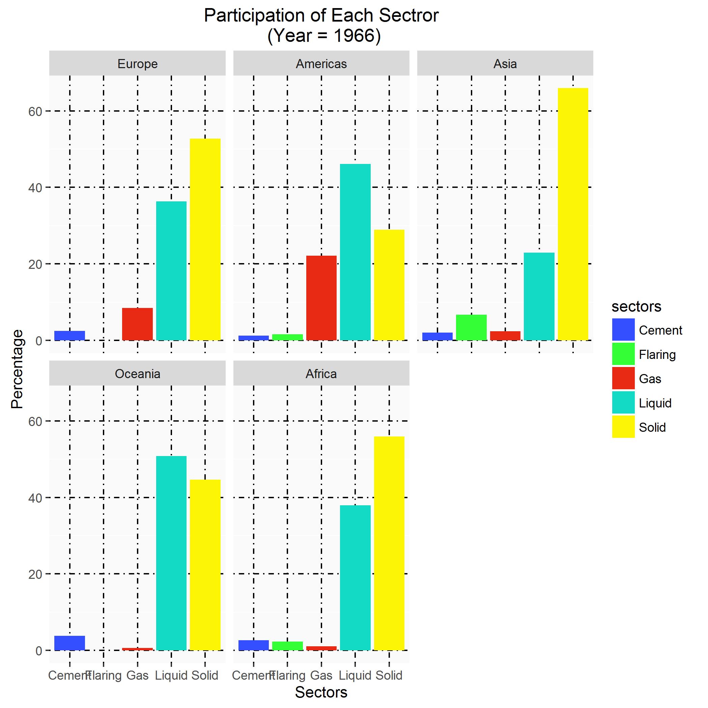
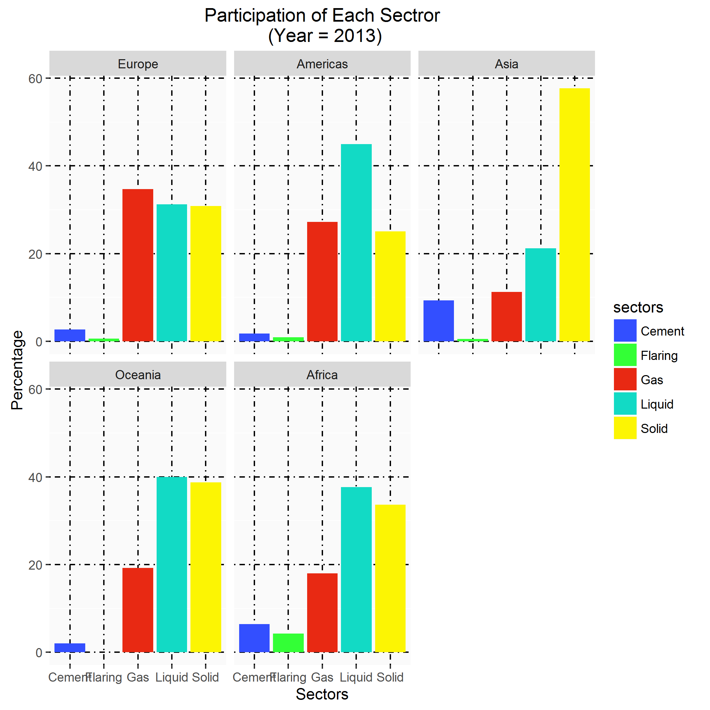
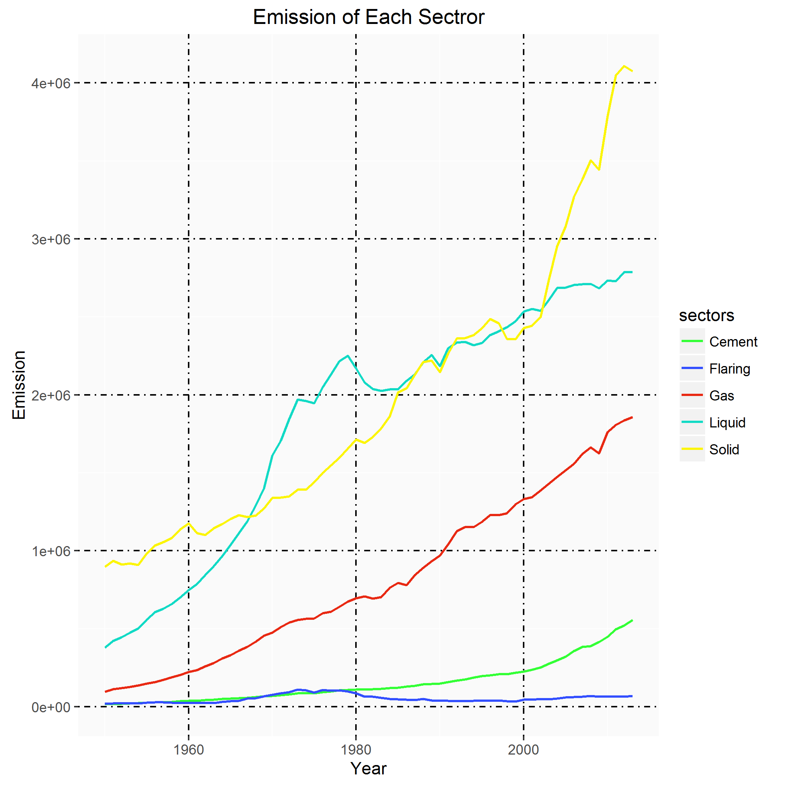
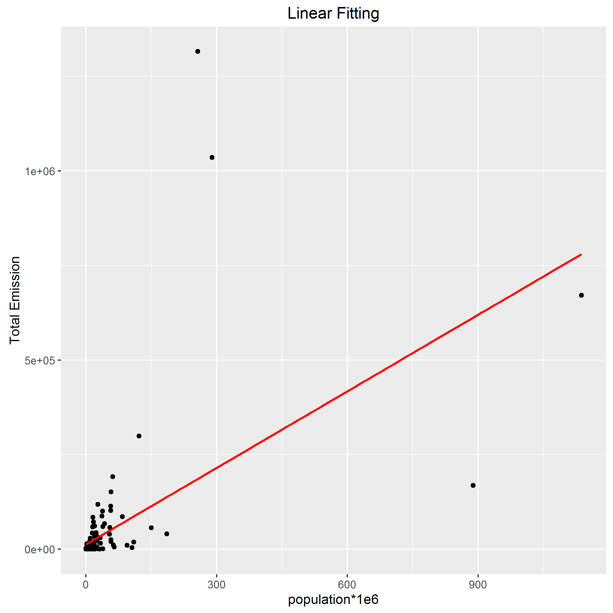
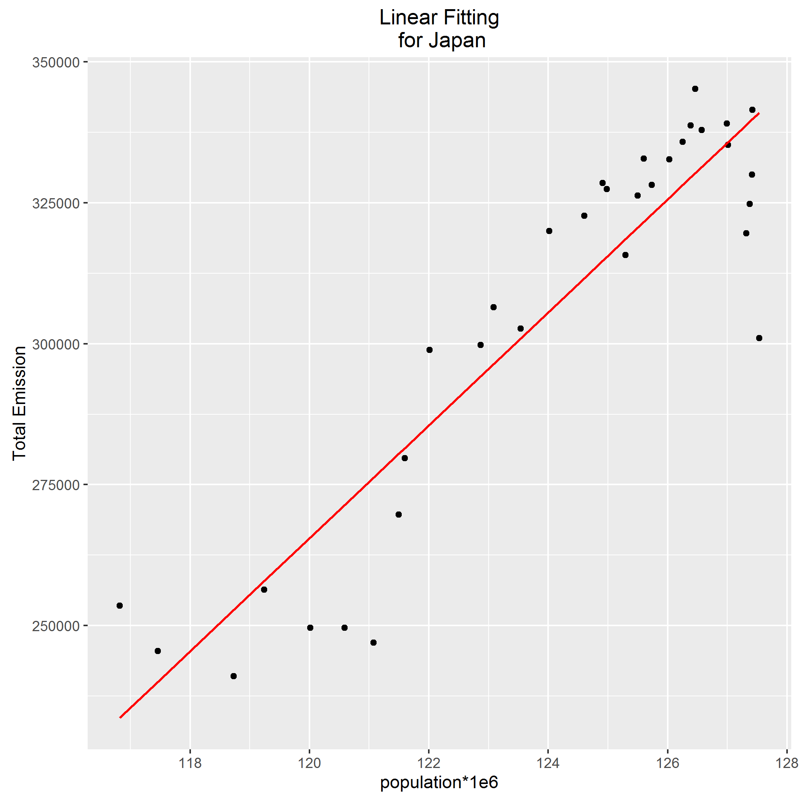

```{r setup, include=FALSE}
knitr::opts_chunk$set(echo = TRUE)
```

## Portion of Each Sector in Carbon Emission
Firstly, portion of participation in each sector is extracted from raw data. Sectors participating in carbon emission are solid fuel, gas fuel, and liquid fuel consumption. Moreover, cement production and gas flaring are included in partipating sectors.

The following tables show percentage of each sector for different continents in different years.

```{r}
library(tidyverse)
library(readr)
Continent_Portions <- dget("Continent_Portions.text") %>% 
  rename(Gas = Gas_Percent,
         Liquid = Liquid_Percent,
         Solid = Solid_Percent,
         Cement = Cement_Percent,
         Flaring = Flaring_Percent)

Continent_Portions %>% 
  filter(year %in% c(1950,1966, 1982, 1997, 2013), 
         continent == "Africa") %>% 
  knitr:: kable()

Continent_Portions %>% 
  filter(year %in% c(1950,1966, 1982, 1997, 2013), 
         continent == "Americas") %>% 
  knitr:: kable()

Continent_Portions %>% 
  filter(year %in% c(1950,1966, 1982, 1997, 2013), 
         continent == "Asia") %>% 
  knitr:: kable()

Continent_Portions %>% 
  filter(year %in% c(1950,1966, 1982, 1997, 2013), 
         continent == "Europe") %>% 
  knitr:: kable()

Continent_Portions %>% 
  filter(year %in% c(1950,1966, 1982, 1997, 2013), 
         continent == "Oceania") %>% 
  knitr:: kable()
```

In the following figures, bar plot related to portion of carbon emission caused by each sector is depicted for each continent. It can be concoluded from the graphs that in the middle parts of previous century, solid fuels were the dominant cause of carbon emission, while gas and liquid fuels were in minority. This habit has been changed and participation percentage of liquid and gas fuels have been increased by time. Moreover, during recent years liquid and gas fuels were dominant reason of carbon emission








## Participation of Each Continent in Carbon Emission
After analyzing the consiquenses of different sectors in different continents and different years, now we are ready to do analysis on the participation of each continent in carbon emission.

The tables below show participation percentage of each continent in years 1950, 1966, 1982, 2013. This amount is shown visually in bar charts for aforementioned years.

```{r}
Continent_Participation <- dget("Continent_Participation.text")

Continent_Participation %>% 
  filter(year %in% c(1950,1966, 1982, 1997, 2013), 
         continent == "Africa") %>% 
  knitr:: kable()

Continent_Participation %>% 
  filter(year %in% c(1950, 1966, 1982, 1997, 2013),
         continent == "Americas") %>% 
  knitr:: kable()

Continent_Participation %>% 
  filter(year %in% c(1950, 1966, 1982, 1997, 2013),
         continent == "Asia") %>% 
  knitr:: kable()

Continent_Participation %>% 
  filter(year %in% c(1950, 1966, 1982, 1997, 2013),
         continent == "Europe") %>% 
  knitr:: kable()

Continent_Participation %>% 
  filter(year %in% c(1950, 1966, 1982, 1997, 2013),
         continent == "Oceania") %>% 
  knitr:: kable()
```


It can be seen that in the middle years of previous century, Americas and Europe were leading continents in carbon emission, but they have given their position to Asia during recent years.

Then, it is useful to rank continents according to their average carbon emission since 1950. The figure below shows this ranking


It is seen that Americas and Europe were leading continents according to their average contribution in carbon emission (35%) followed by Asia (21%). Oceania and Africa were in minority in comparison to their counterparts in this sense (less than 10%)

##Changes in Behaviour of Emission for each sector
Now we are ready to analyze the amount of emission for each sector. The graph below compares carbon emission of each sector since 1950.



It can be seen that gas flaring and cement production were in minority compared to their counterparts. Emission caused by gas flaring remained unchanged to some extent during the interval  between 1950 to 2013, while participation of cement industry has incresed steadily since 1980.

Moreover, we can see that emission caused by gas fuel, liquid fuel, and solid fuel had an increasing trend in this time interval. Additionally, this trend was more intensive for liquid and solid fuel. It is interesting to know that increasing trend of carbon emission caused by solid fuels was more abrupt from 2000.

##Relationship between population and carbon emission
It was interesting for me to know whether it is correct to say more populated countries emit more carbon to atmosphere; hence, to analyze this, the dot plot comparing population with carbon emission in 1990 is depicted as below. It should be noticed that the red line refers to linear model estimating the behaviour of carbon emission against population.



According to the graph, it can be concoluded that the foregoing assumption is true to some extent.

In addition, the multipliers of linear model, fitting population against emission for each country, is extracted using *lm()* function. These multipliers can be detected in the following table for first 10 participant countries in carbon emission.

```{r}
dget("Emission_vs_Pop.text") %>% 
  head(10) %>% 
  knitr:: kable()
```

The following figure shows Japan's emission against different populations it had. This figure measures the accuracy of linear modelling; moreover, it shows that in Japan carbon emission increased by population growth.




